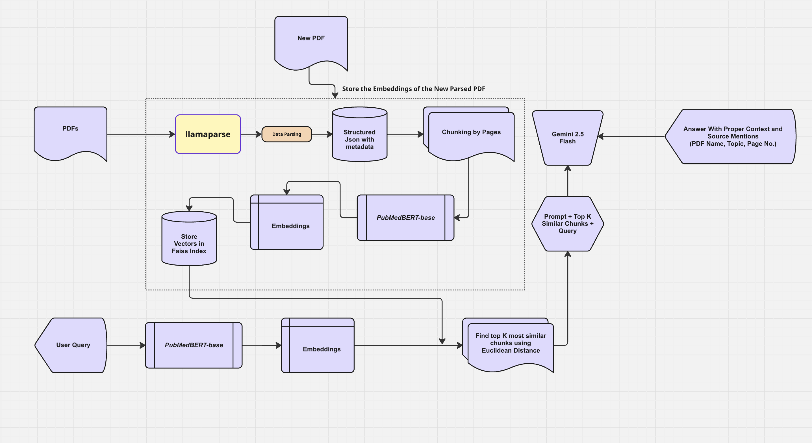
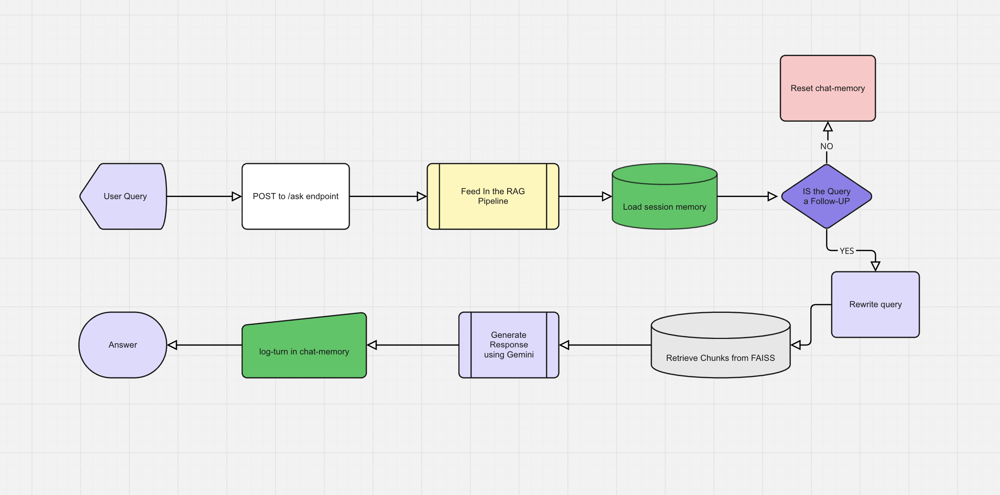

# 🩺 Medical Document QA Chatbot (RAG with PubMedBERT + Gemini)

A powerful Question Answering chatbot for medical PDFs (e.g. **IMCI Chart Booklet**, **Pocket Book of Hospital Care for Children**) built using a **Retrieval-Augmented Generation (RAG)** pipeline with:

- 🧠 **PubMedBERT** for domain-specific embeddings  
- ⚡ **Gemini Flash** for fast, cost-efficient LLM responses  
- 🗂️ **FAISS** for scalable similarity search  
- 🌐 **FastAPI** backend to serve as an inference API  
- 🧾 **Structured document parsing** (tables, headings, charts)  
- 💬 **Conversational memory** with intelligent follow-up tracking  

---

## 🔧 Features

- ✅ Chunk-by-item parsing with full metadata (page, section, file)
- ✅ Table-aware embedding using markdown standardisation
- ✅ Follow-up detection using Gemini (YES/NO based)
- ✅ Dynamic query rewriting for context-aware answers
- ✅ Gemini Flash-powered answers with exact citations
- ✅ Incremental document ingestion without recomputing old embeddings
- ✅ FAISS-powered retrieval for top-K relevant chunks
- ✅ Deployable with FastAPI (`/ask` endpoint)

---

## 🗺️ Architecture Overview




## 🗺️ Project Structure

```text
├── docs/
│   └─ Pdfs                  # All the pdfs that are to be parsed
├── data/
│   ├── faiss_index.index        # FAISS vector index
│   ├── embeddings.npy           # NumPy matrix of vectors
│   └── metadata.jsonl           # Corresponding metadata
├── rag_api_fastapi.py                # FastAPI server (entrypoint)
├── rag_incremental_indexer.py        # Create Index for new chunks and generate response
├── generator.py                 # Gemini-based answer generation
├── memory.py                    # Session-aware memory manager
├── preprocess.py                # Document parsing utilities
│                            
├── requirements.txt
└── README.md
├── parsed_pdf/
│   ├── json_files        # json files of parsed pdf with metadata and also python cleaner function
│   
```

## 🚀 Getting Started 

### 1. Clone the Repo

```python
git clone https://github.com/Ravinder210/Medical_QA_Pukaar.git
cd medical-rag-chatbot
```
### 2. Install Dependencies

```python
pip install -r requirements.txt
```


